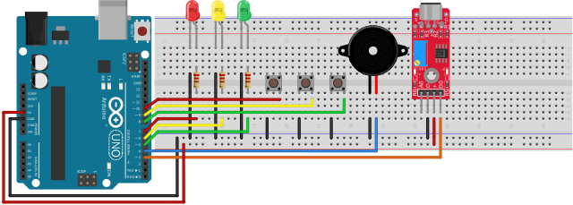

# Clap Rhythm

Clap Rhythm recording saving to storage and play back based on button with led indication.

Rhythem saved even when power off.

## Manual

### Buttons Functions

* Single Press: Play stored rhythm
* Double Press: Detect rhythm
* Long Press: Record and save rhythm

### LEDs Status

* Recording: Single LED ON
* Detecting: Cyler of LEDs
* Not Detcted: 2 Blinks
* Palying: Blink matching rhythm with buzzer

## Hardware

1. 1x Arduino UNO
2. 1x Piezo Buzzer
3. 1x KY-037 (Sound Sensor)
4. 3x Push Button
5. 3x LED (Red, Yellow, Green)
6. 3x Resister (220 Ohm)
7. 19x Jumper Wire (Male to Male)

## Circuit

